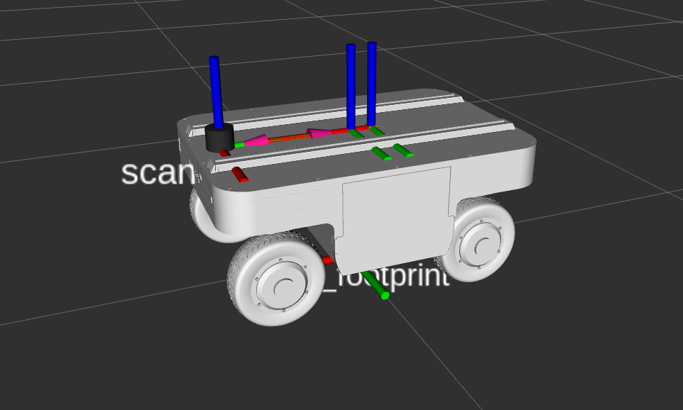
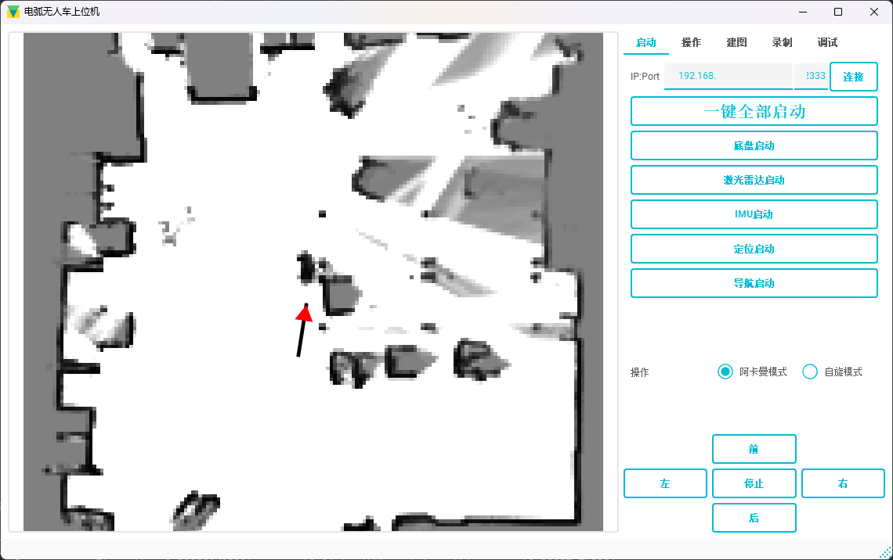
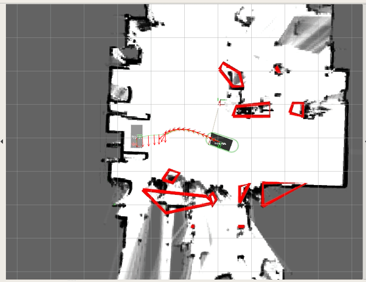
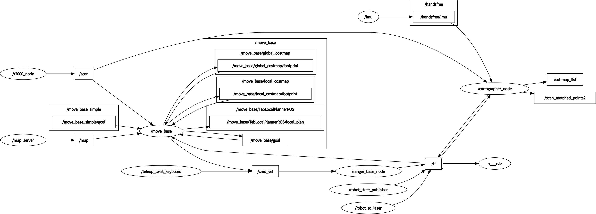
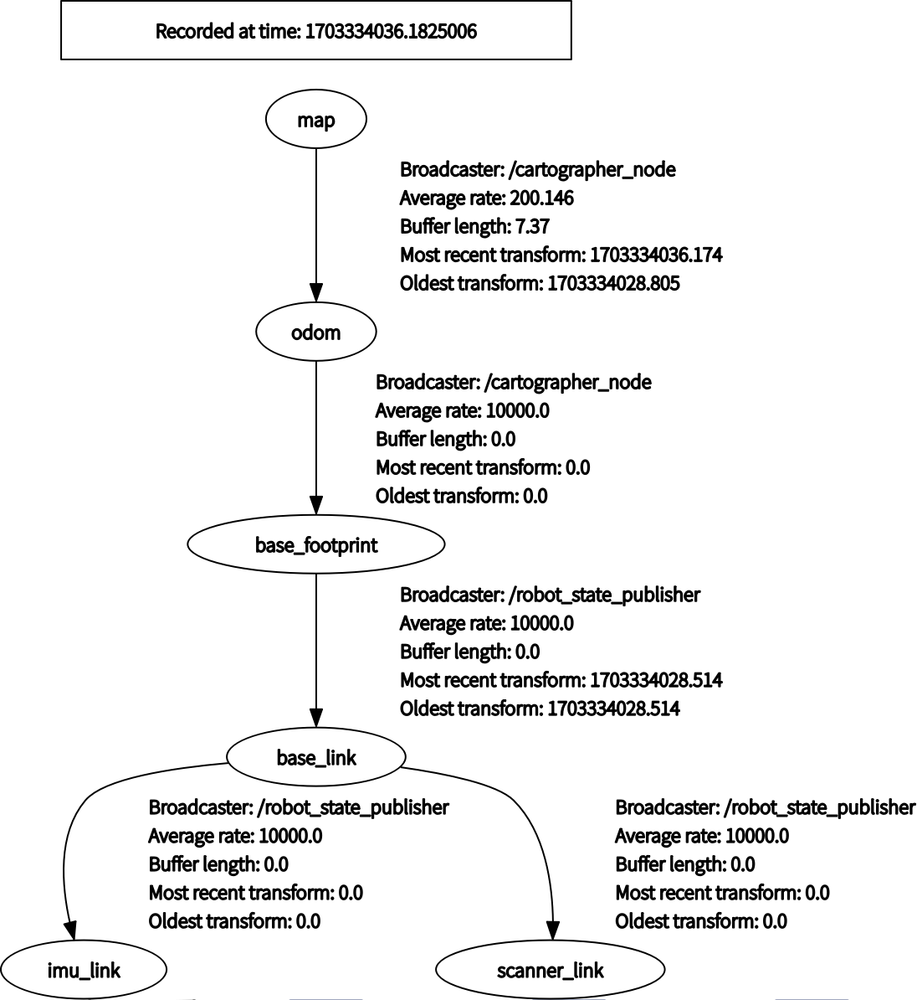

# 使用cartographer+navigation进行建图定位导航
# 开发中，仅供参考


## 元件清单

- 底盘：ranger_mini-v2
- 激光雷达：pf的R2000
- IMU：taobotics的A9
- 主控：jeston nano 4GB
- 其他：明纬50V转24V电源、明纬50V转5V电源

## 技术栈

- 建图：使用cartographer（imu+laser）
- 定位：使用cartographer的纯定位（imu+laser）
- 导航：使用navigation+teb_local_planner
- 上位机：QT+socket


## 上位机




## 效果-亮点展示

主动切换不同运行模式，实现四舵轮模型和阿克曼模型切换

如下图，先为阿克曼模式，后为舵轮斜移模式入库

动图展示见Doc/介绍图片/效果展示-动态2.gif


## 不足与缺点
- 由于松灵的四舵轮底盘舵轮角度只支持180度内旋转，并且舵轮角度旋转速度较慢
- 本程序为了适配此四舵轮的特点属性做了大量针对性调整，例如teb控制器输出cmd处理，单次判断斜移还是导航
- 在teb测试仿真时，会出现规划结果偶尔不收敛

## 更新日志

- 初步大框架
- ranger_mini_urdf修正完成
- 修改imu为imu_link，机器人为base_link。成功部署carlike
- 搭建上位机大框架
- movebase节点添加imu数据
- 短距和远距模式切换
- 远距模式使用阿克曼车模，短距模式判断角度是否简单斜移，斜移就四舵轮模型。


## 安装步骤


1. **下载并安装鱼香ros**
   - 安装ros1：使用鱼香ros一键安装（jetson nano 使用ubuntu 18.04 melodic(ROS1)）
   - 一键安装：rosdep(小鱼的rosdepc,又快又好用)
   - 一键安装：VsCode开发工具
   - 一键配置：python国内源
    ```bash
    wget http://fishros.com/install -O fishros && . fishros
    ```

2. **安装git**
    ```bash
    sudo apt-get install git
    ```

3. **下载github仓库代码**
    ```bash
    git clone https://github.com/we-worker/Graduation_project.git
    ```

4. **下载子git仓库文件**，如果这一步迟迟未响应，修改.gitmodules文件中的github链接为镜像连接。
    ```bash
    cd Graduation_project
    git submodule update --init  --recursive
    ```

5. **编译IMU**
    ```bash
    cd Graduation_project/IMU
    catkin_make
    ```

6. **编译pf激光雷达**
    ```bash
    cd Graduation_project/pf_laser
    rosdep install --from-paths src --ignore-src --rosdistro=$ROS_DISTRO -y
    catkin_make
    ```

7. **编译ranger底盘ros驱动器**
    ```bash
    sudo apt install libasio-dev libboost-all-dev
    cd Graduation_project/ranger_ros
    catkin_make
    ```

8. **编译navigation**
    ```bash
    cd Graduation_project/navigation
    rosdep install --from-paths src --ignore-src -r -y
    catkin_make
    ```

9.  **编译cartographer**
    ```bash
    cd Graduation_project/cartographer
    rosdep install --from-paths src --ignore-src --rosdistro=${ROS_DISTRO} -y
    sudo apt-get install -y clang cmake g++ google-mock \
        libboost-all-dev \
        libcairo2-dev \
        libcurl4-openssl-dev \
        libeigen3-dev \
        libgflags-dev \
        libgoogle-glog-dev \
        liblua5.2-dev \
        libsuitesparse-dev \
        lsb-release \
        ninja-build \
        stow
    sudo src/cartographer/scripts/install_abseil.sh
    解压meshes材质文件
    tar -xJvf ./src/mycarto/meshes/meshes.tar.xz -C ./src/mycarto/meshes/
    catkin_make_isolated --install --use-ninja
    ```

10. **安装一个分屏终端方便使用**
    ```bash
    sudo apt-get install terminator
    ```

11. **启动方法**见Doc目录，start.sh文件,start.py文件，注意请关闭sudo 密码

12. **仿真数据集**解压Doc/datas/902-data-lidar-odom-imu.7z


## 节点图




